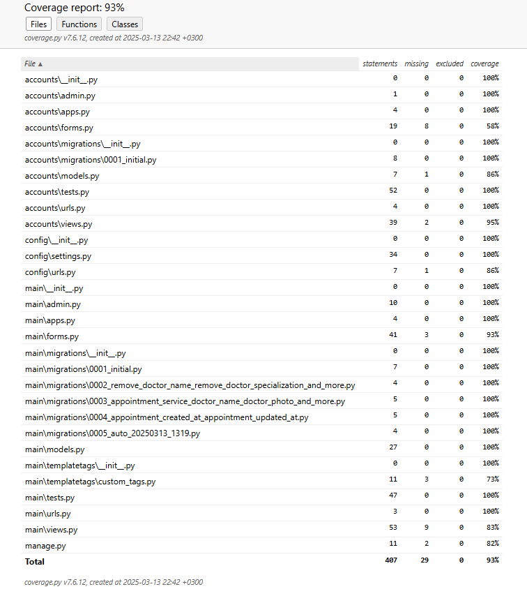

# Сайт компании медицинской диагностики

## Содержание
- [Описание](#описание)
- [Установка и запуск](#установка-и-запуск)
- [Использование](#использование)
- [Покрытие тестами](#покрытие-тестами)

## Описание
Этот проект представляет собой веб-приложение на базе Django для автоматизированного управления процессами компании медицинской диагностики. Приложение использует PostgreSQL в качестве базы данных и упаковывается в контейнеры Docker для удобства развертывания и масштабирования.

## Установка и запуск
* Склонируйте репозиторий
* Перейдите в папку с проектом
```bash
cd med
```
* Затем установим все зависимости из pyproject.toml
```bash
poetry install
```
* Для определения необходимых переменных окружения воспользуйтесь шаблоном
```bash
.env.sample
POSTGRES_USER=
POSTGRES_PASSWORD=
POSTGRES_DB=
DB_HOST=
SECRET_KEY=
DEBUG=
EMAIL_HOST_USER=
EMAIL_HOST_PASSWORD=
SUPPORT_EMAIL=
DEFAULT_FROM_EMAIL=
```
* Сделайте миграции
```bash
python manage.py makemigrations
python manage.py migrate
```
* Создайте суперпользователя
```bash
python manage.py createsuperuser 
```
*Для запуска сервера сайта выполните команду:
```bash
python manage.py runserver
```
* Для сборки образа и запуска контейнера, выполните команду
```sh
docker-compose up -d --build
```
## Использование
* На странице "главная" представлены услуги и специалисты компании.
* На странице "о компании" можно узнать историю компании и ее предназначение.
* На странице "услуги" представлен весь комплекс услуг компании в алфавитном порядке. Можно перейти на любую из них и узнать что это за процедура и сколько стоит. Также перейдя по ссылки на процедуру можно будет сразу записаться на нее.
* На странице "специалисты" представлены все врачи компании. Указаны имя, фамилия и специализация.
* Чтобы войти в личный кабинет необходимо зарегестрироваться на сайте (или авторизоваться если уже зарегестрирован). В личном кабинете можно записаться на любую услугу. Также можно отменить или изменить записи.
* На вкладке "контакты" есть контактная информации клиники, также карта проезда.
* На вкладке "поддержка" можно указать имя, фамилию и вопрос. Вся эта информация поступит админу сайта на почту, т.е. мне.
## Покрытие тестами
